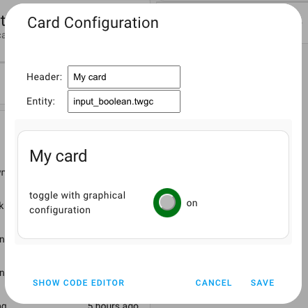

# Toggle With Graphical Card Configuration (Vanilla JS)



From YAML editor to a graphical editor

***

* @published: May 2023
* @author: Elmar Hinz
* @workspace: `conf/www/tutor`
* @name: `toggle-with-graphical-configuration`
* @id: `twgc`

You learn:

* how to create and organize the class of the editor
* how to register the editor
* the lifecycle of the editor
* some minimal stuff to implement

## Goal

Analogous to the card you learn how to do a graphical editor with plain vanilla
javascript and a shadow dom. Actually the two classes come quite close. We can
focus upon the differences.

In this tutorial we still want to avoid dependencies from external libraries to
learn about the minimal requirements. The downside is, the we don't get the full
comfort of the homeassistant inbuilt forms. This may be the topic of a future
howto. We also do our own minimalistic styling.

## Prerequisites

* tutorial 05: toggle card with shadow dom
* you know how to register `card.js` as a resource
* you know how to create the helper entity of type boolean aka toggle
* you know how to add and edit a card
* you know how to reload `card.js` after editing

In doubt revisit tutorial 02.

## Setup

Take the same steps as in the previous tutorial. Name the helper entity
`twgc` this time.

### Connecting the graphical editor

Once you created the editor's class `ToggleWithGraphicalConfigurationEditor`
you register it as a new custom element.

```js
customElements.define('toggle-with-graphical-configuration-editor', ToggleWithGraphicalConfigurationEditor);
```

Then you add it to the card itself.

```js
    static getConfigElement() {
        return document.createElement("toggle-with-graphical-configuration-editor");
    }
```

## The code

### The lifecycle

The lifecycle of the editor is basically the same as the lifecycle of the card.
Even `setConfig(config)` and `set hass(hass)` have the same signature. Again
we do the heavy load only once inside the constructor and react upon updates
triggered by `setConfig()`. I even added `set hass()` to show it is called
during the lifecycle, though there is nothing to do otherwise then logging.

### Differences

The *card* element is called *editor* in this class and method names are
adjusted accordingly. HTML and CSS are completely different. You also have
to listen to different events and act differently.

### HTML and CSS

It is a simple form with two text input fields, one for the header, one for the
entity.

```js
    doEditor() {
        this._elements.editor = document.createElement("form");
        this._elements.editor.innerHTML = `
            <div class="row"><label class="label" for="header">Header:</label><input class="value" id="header"></input></div>
            <div class="row"><label class="label" for="entity">Entity:</label><input class="value" id="entity"></input></div>
        `;
    }

    doStyle() {
        this._elements.style = document.createElement("style");
        this._elements.style.textContent = `
            form {
                display: table;
            }
            .row {
                display: table-row;
            }
            .label, .value {
                display: table-cell;
                padding: 0.5em;
            }
        `
    }

```

### Setting header and entity id

Upon the first update of the configuration we get access to header and entity
id. You could do more advanced checks and use accessor functions.

```js
    doUpdateConfig() {
        this._elements.header.value = this._config.header;
        this._elements.entity.value = this._config.entity;
    }
```

In this tutorial we trust that there are reasonable values. Upon creation of the
card they are given as defaults from within the class of the card.

```js
    static getStubConfig() {
        return {
            entity: "input_boolean.twgc",
            header: ""
        }
    }
```

### Listening for updates

We use `focusout` events to trigger the update of the underlying model.

```js
    doListen() {
        this._elements.header.addEventListener("focusout", this.onChanged.bind(this));
        this._elements.entity.addEventListener("focusout", this.onChanged.bind(this));
    }
```

See previous tutorial for the importance of binding the current context.

```js
    onChanged(event) {
        console.log("editor.onChanged()")
        this.doMessageForUpdate(event)
```

We use a general entrypoint for both events which calls a general job to handle
the events. By dispatching a custom event `config-changed` we request the update
of the underlying model.

```js
    doMessageForUpdate(changedEvent) {
        // this._config is readonly, copy needed
        const newConfig = Object.assign({}, this._config);
        if (changedEvent.target.id == "header") {
            newConfig.header = changedEvent.target.value;
        }
        else if (changedEvent.target.id == "entity") {
            newConfig.entity = changedEvent.target.value;
        }
        const messageEvent = new CustomEvent("config-changed", {
            detail: { config: newConfig },
            bubbles: true,
            composed: true,
        });
        this.dispatchEvent(messageEvent);
    }
```

This method is a little more complex. The original configuration is write
protected. We create a copy to send it along with the custom event. Then we have
to switch between the two events we have been listening for *header* and
*entity*. Finally we create the new custom event and dispatch it.
